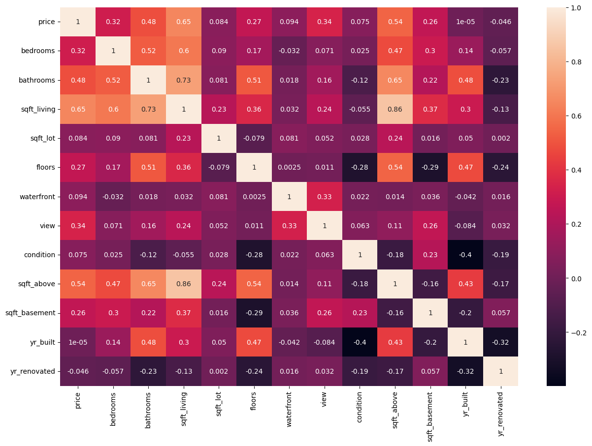
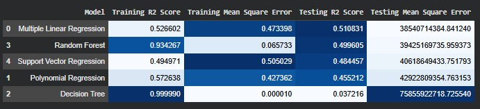

# 🏠 House Price Analysis & Prediction

A machine learning project that analyzes housing price data, performs data preprocessing, explores feature relationships, and compares multiple regression models to predict house prices.

---

# Preview

### Dataset Overview


### Correlation Heatmap



### Model Comparison



---

# Objectives

- Analyze housing datasets
- Perform data preprocessing and cleaning
- Explore relationships between housing features
- Train and compare multiple regression models
- Evaluate prediction performance

---

# Dataset

The project uses a housing dataset containing various property attributes, including:

- Price
- Bedrooms
- Bathrooms
- Living Area (sqft)
- Lot Size
- Floors
- Waterfront
- View
- Condition
- Year Built
- Year Renovated

Dataset file included in this repository:

```
data.csv
```

---

# Technologies

- Python
- Pandas
- NumPy
- Matplotlib
- Plotly
- Scikit-learn

---

# Machine Learning Models

This project compares several regression algorithms:

- Linear Regression
- Polynomial Regression
- Decision Tree Regressor
- Random Forest Regressor
- Support Vector Regression (SVR)

---

# Project Workflow

1. Import Dataset
2. Data Cleaning
3. Exploratory Data Analysis (EDA)
4. Correlation Analysis
5. Data Visualization
6. Feature Scaling
7. Train/Test Split
8. Model Training
9. Model Evaluation
10. Performance Comparison

---

# Results

Several regression models were trained and evaluated using:

- R² Score
- Mean Squared Error (MSE)

The notebook compares each model's performance to determine which regression algorithm provides the best prediction accuracy.

---

# Repository Structure

```text
house-price-analysis/
│
├── images/
│   ├── Data Exploration Head.jpeg
│   ├── Data Exploration Tail.jpeg
│   ├── Comparing model.jpeg
|   └── Visualization.png
|   
│
├── HousePriceAnaliysis.ipynb
├── data.csv
└── README.md
```

---

# How to Run

Clone this repository

```bash
git clone https://github.com/Ghozi1/house-price-analysis.git
```

Open the project

```bash
cd house-price-analysis
```

Launch Jupyter Notebook

```bash
jupyter notebook
```

Open:

```
HousePriceAnaliysis.ipynb
```

---

# Future Improvements

- Hyperparameter tuning
- Cross-validation
- Feature selection
- Model deployment using Flask or FastAPI
- Interactive dashboard for prediction

---

# Author

**Muhammad Ghozi Al Ghifari**

GitHub:
https://github.com/Ghozi1

---

# License

This project is intended for educational and portfolio purposes.
